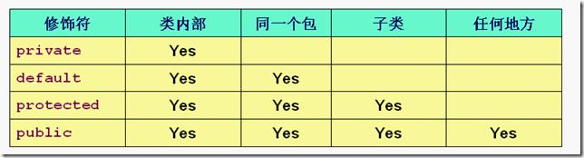
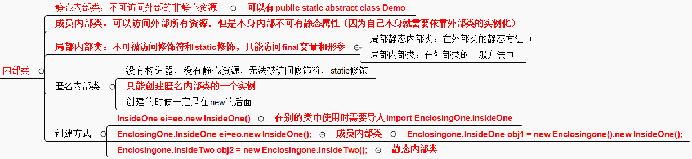
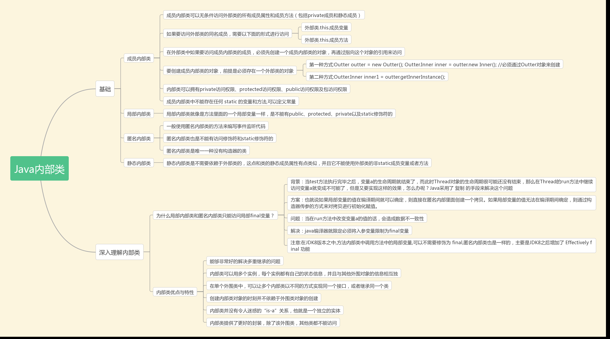

<!--
 * @Date: 2021-12-07 21:20:07
 * @LastEditors: ELROY
 * @LastEditTime: 2021-12-11 15:58:47
 * @FilePath: \Git\Ja\Basic.md
-->

# Java基础

## 重写

参数列表必须完全与被重写方法的相同；

返回类型必须完全与被重写方法的返回类型相同；

访问权限不能比父类中被重写的方法的访问权限更低。例如：如果父类的一个
方法被声明为public，那么在子类中重写该方法就不能声明为protected。
父类的成员方法只能被它的子类重写。

声明为final的方法不能被重写。

声明为static的方法不能被重写，但是能够被再次声明。

子类和父类在同一个包中，那么子类可以重写父类所有方法，除了声明为private和final的方法。

子类和父类不在同一个包中，那么子类只能够重写父类的声明为public和protected的非final方法。

重写的方法能够抛出任何非强制异常，无论被重写的方法是否抛出异常。但是，重写的方法不能抛出新的强制性异常，或者比被重写方法声明的更广泛的强制性异常，反之则可以。

构造方法不能被重写。

如果不能继承一个方法，则不能重写这个方法。

两同两小一大原则：

两同：方法名和参数列表相同

两小：返回值或声明异常比父类小（或相同）

一大：访问修饰符比父类的大（或相同）

## 重载

被重载的方法必须改变参数列表(参数个数或类型或顺序不一样)；

被重载的方法可以改变返回类型；

被重载的方法可以改变访问修饰符；

被重载的方法可以声明新的或更广的检查异常；

方法能够在同一个类中或者在一个子类中被重载。

无法以返回值类型作为重载函数的区分标准。

## 修饰符权限

- Java中类是单继承，但接口可以多继承
- 静态方法，可以通过【类名.方法名】的形式调用，而不必去实例化一个对象进行方法的调用；
- 子类不可以继承父类的构造方法，只可以调用父类的构造方法。子类中所有的构造函数都会默认访问父类中的空参数构造函数，这是因为子类的构造函数内第一行都有默认的super（）语句。super（）表示子类在初始化时调用父类的空参数的构造函数来完成初始化。一个类都会有默认的空参数的构造函数，若指定了带参构造函数，那么默认的空参数的构造函数，就不存在了。这时如果子类的构造函数有默认的super（）语句，那么就会出现错误，因为父类中没有空参数的构造函数。因此，在子类中默认super（）语句，在父类中无对应的构造函数，必须在子类的构造函数中通过this或super（参数）指定要访问的父类中的构造函数。 方法没有继承一说，只有重载和重写
- 
- 
- abstract类不能用来创建abstract类的对象
- final类不能用来派生子类，因为用final修饰的类不能被继承
- final不能与abstract同时修饰一个类，abstract类就是被用来继承的
- 类中有abstract方法必须用abstract修饰，但abstract类中可以没有抽象方法，接口中也可以有abstract方法
- final类型的变量一定要初始化，因为final的变量不可更改。
- 子类应该是可以置换掉父类的同步方法的
- java用（监视器）机制实现了线程之间的同步执行
- 抽象类不能实例化
- 抽象类中可以没有抽象方法，但是抽象方法必须在抽象类中或者接口中
  
- static不可以修饰非static的属性，因为类加载的时候，static属性比非static先初始化，那么一个存在的总不能访问一个没有存在的吧。
  
- 当编写一个java源代码文件时，此文件通常被称为编译单元（有时也被称为转译单元）。每个编译单元都必须有一个后缀名.java，而在编译单元内则可以有一个public类，该类的名称必须与文件的名称相同（包括大小写，但不包括文件的后缀名.java）。每个编译单元只能有一个public类，否则编译器就不会接受。如果在该编译单元之中还有额外的类的话，那么在包之外的世界是无法看见这些类的，这是因为它们不是public类，而且它们主要用来为主public类提供支持。
  
- 能被类直接调用，说明是静态的，随着类的加载而加载
  
- ConcurrentHashMap 使用segment来分段和管理锁，segment继承自ReentrantLock，因此ConcurrentHashMap使用ReentrantLock来保证线程安全。
  
- 调用sleep()方让线程进入睡眠状态---睡眠指定的时间后再次执行；调用wait()方让线程进入等待状态 ----等待别的线程执行notify()或notifyAll()唤醒后继续执行；调用start()方***让线程进入就绪状态---得到CPU时间就执行线程；run()方法是线程的具体逻辑方法，执行完，线程就结束。
-
- | 基本数据类型 | 包装类    |
  | ------------ | --------- |
  | byte         | Byte      |
  | boolean      | Boolean   |
  | short        | Short     |
  | char         | Character |
  | int          | Integer   |
  | long         | Long      |
  | float        | Float     |
  | double       | Double    |

- synchronized保证三大性，原子性，有序性，可见性，volatile保证有序性，可见性，不能保证原子性
  
- final关键字：final修饰符，可以修饰类，方法，变量,不能修饰接口
- final修饰的类不可以被继承
- final修饰的方法不可以被覆盖
- final修饰的变量为常量。只能赋值一次
- 一般final化的成员变量也会静态化
  
- 创建线程对象两种方式：1.继承Thread类，重载run方法；2.实现Runnable接口，实现run方法 
  
- 如果在常量池中已经存在string对象，那么不会继续创建，只创建一个new String("xxx")的对象。如果常量池中没有，则会创建两个对象，一个是对象的值“xyz”，一个是new String("xxx")的对象。
  
- 加载驱动方法:1.Class.forName("com.microsoft.sqlserver.jdbc.SQLServerDriver");2. DriverManager.registerDriver(new com.mysql.jdbc.Driver());3.System.setProperty("jdbc.drivers", "com.mysql.jdbc.Driver");

- 在同一个java原文件中，可以有多个class类，但是只有有一个公共的 public class

- private修饰的父类方法，子类没有对父类私有方法的访问权限。

- 抽象类不一定含有抽象方法，接口中的方法都是抽象方法。
接口中的方法默认修饰符有public abstract。

- 一个类只能继承一个一个抽象类，但可以实现多个接口；一个接口可以继承多个接口。
Java里类是单继承的，接口是可以多继承的，用关键字extends。

- 抽象类可以含有私有成员变量，接口不含有私有成员变量。
接口中的成员变量都是public static final的，一般用作常量。

- 接口中的属性必然是常量，只能读不能改，常量一般的定义为：
public static final 数据类型 常量名

- 类中静态语句块仅在类加载时被执行一次

- 使用泛型的好处:1，类型安全。 泛型的主要目标是提高 Java 程序的类型安全。通过知道使用泛型定义的变量的类型限制，编译器可以在一个高得多的程度上验证类型假设。没有泛型，这些假设就只存在于程序员的头脑中（或者如果幸运的话，还存在于代码注释中）。2，消除强制类型转换。 泛型的一个附带好处是，消除源代码中的许多强制类型转换。这使得代码更加可读，并且减少了出错机会。3，潜在的性能收益。 泛型为较大的优化带来可能。在泛型的初始实现中，编译器将强制类型转换（没有泛型的话，程序员会指定这些强制类型转换）插入生成的字节码中。但是更多类型信息可用于编译器这一事实，为未来版本的 JVM 的优化带来可能。由于泛型的实现方式，支持泛型（几乎）不需要 JVM 或类文件更改。所有工作都在编译器中完成，编译器生成类似于没有泛型（和强制类型转换）时所写的代码，只是更能确保类型安全而已。所以泛型只是提高了数据传输安全性，并没有改变程序运行的性能
-   

- Thread.sleep() 和 Object.wait(),都可以抛出 InterruptedException。这个异常是不能忽略的,因为它是一个检查异常(checked exception)
- intValue()是把Integer对象类型变成int的基础数据类型；
parseInt()是把String 变成int的基础数据类型；
Valueof()是把String 转化成Integer对象类型；（现在JDK版本支持自动装箱拆箱了。）

  
- Java 中的堆是 JVM 所管理的最大的一块内存空间，主要用于存放各种类的实例对象。
在 Java 中，堆被划分成两个不同的区域：新生代 ( Young )、老年代 ( Old )。新生代 ( Young ) 又被划分为三个区域：Eden、From Survivor、To Survivor。
这样划分的目的是为了使 JVM 能够更好的管理堆内存中的对象，包括内存的分配以及回收。